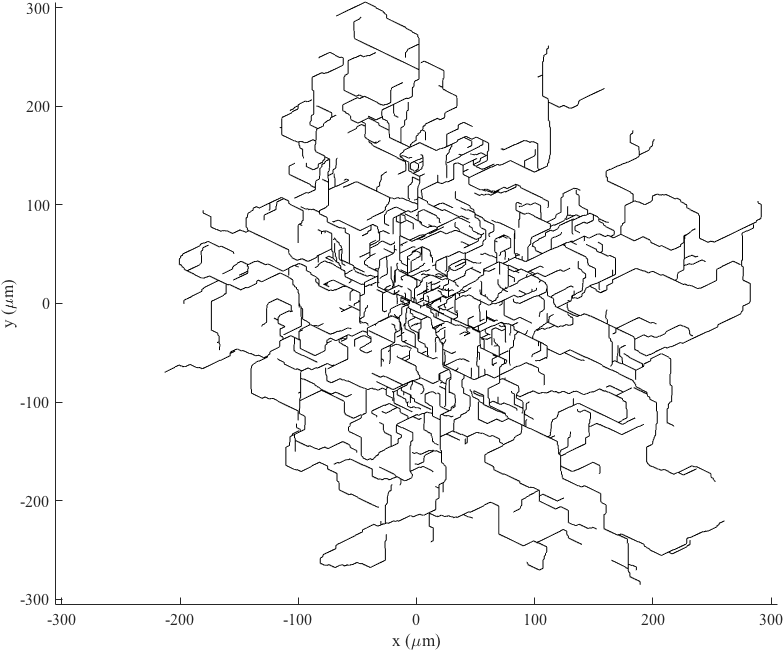

# Self-avoiding branching tree (sabt)
This is a Matlab codebase implementing the branching and self-avoidance of a tree.

# Getting started
Run `sabt_ex.m` to simulate the growth of a tree and plot the results of the simulation.

# Model Description
Branches grow at a speed of 1 lattice spacing/timestep. The lattice spacing and timestep are dimensionless.

New branches are created uniformly across the tree and the number of new branches is determined by drawing from a Poisson distribution with a mean of gamma (&gamma;)

The persistence length of each branch is determined by beta. For each
spatial step, the angle of growth changes by &Delta; &theta; where
&Delta; &theta; is normally distributed with mean = 0 and variance = 2 / &beta;.

Upon collision with another branch, branches retract a random length *l*, where
*l* is exponentially distributed with mean = &alpha;. The retraction speed is equal to
the growth speed. Retraction continues through the parent branch when
the sister branch has completely retracted.

# Model parameters
* alpha (&alpha;) : Mean retraction length. This parameter controls the amount of length retracted upon collision.

* beta (&beta;): Persistence Length: This parameter controls the straightness of a branch.
A higher persistence length will simulate straighter branches.
* gamma (&gamma;): Branching Frequency. This parameter controls the amount of branches added to the tree during the simulation.
